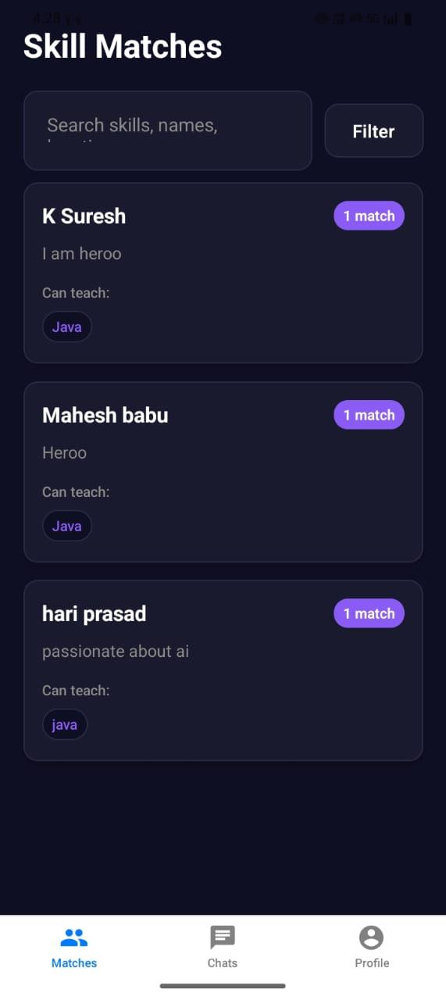
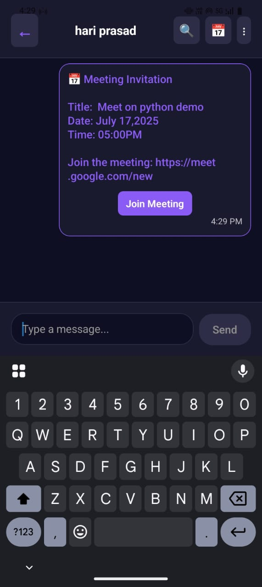
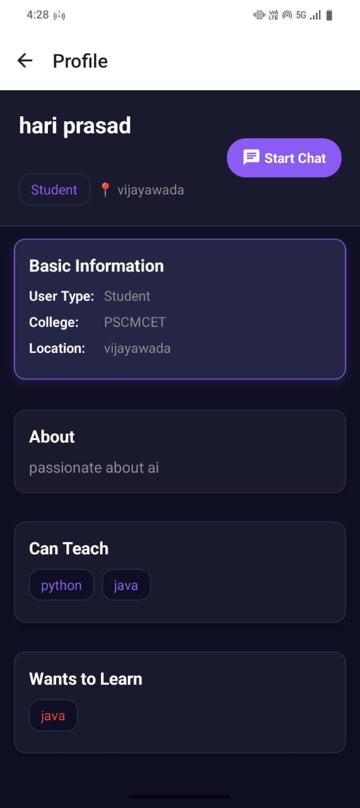
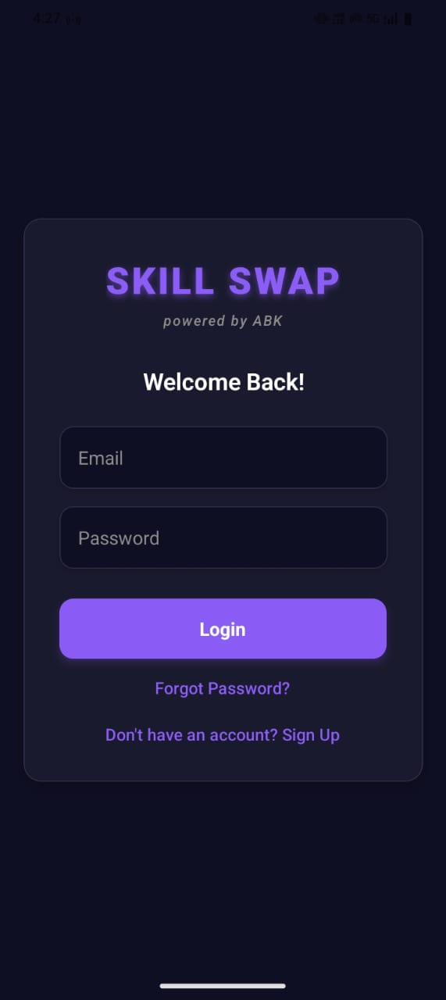

# 💡 Skill Swap App

A cross-platform AI-powered app that helps people **connect, learn, and grow** by exchanging skills.  
Whether you want to **teach** what you know or **learn** what you love — Skill Swap is the platform for peer-to-peer collaboration. 🤝

---

## 🚀 Features

- 🔐 **OAuth 2.0 Authentication** (Google Sign-In)
- 🧠 **Skill Matching Engine** – Matches users based on what they want to learn/teach
- 👤 **User Profiles** – Custom bio, skill tags, and social links
- 💬 **Real-Time Chat** – Powered by Firebase
- 🤖 **Gemini 2.5 AI Assistant** – In-chat AI for suggestions & meeting help
- 🔍 **Searchable Chat** – Quickly find messages
- 🚫 **Block/Unblock Users** – Safe messaging environment
- 📅 **Google Meet Scheduling** – Schedule calls directly from chat
- 🌐 **Multi-Platform Support** – Android, iOS, Desktop & Web

---

## 🛠️ Tech Stack

| Feature                | Tech Used                               |
|------------------------|------------------------------------------|
| Frontend               | React Native (Expo SDK 53)               |
| Web Support            | React Native Web                         |
| Styling                | Tailwind CSS via NativeWind              |
| Authentication         | Firebase Auth + OAuth 2.0 (Google)       |
| Database               | Firebase Firestore                       |
| AI Assistant           | Gemini 2.5 (Google Generative AI)        |
| Scheduling             | Google Calendar & Google Meet APIs       |
| Backend Functions      | Firebase Cloud Functions                 |
| Push Notifications     | Firebase Cloud Messaging (FCM)           |
| Hosting (Web)          | Vercel                                   |
| Mobile Build & Deploy  | Expo EAS Build                           |
| Version Control        | GitHub                                   |

---


## 📸 Screenshots

### 🧠 Skill Match Screen  


### 📅 Google Meet Scheduler  


### 👤 Profile Info  


### 👥 Profile Match  


### 🔐 Login / Google OAuth  



- 🧠 Skill Match Screen  
- 💬 Gemini Chat Integration  
- 📅 Schedule Google Meet  
- 👤 Profile Info  
- 🔐 Login / Google OAuth

---

## 🧪 Getting Started

### 1. Clone the Repository

```bash
git clone https://github.com/your-username/skill-swap-app.git
cd skill-swap-app
